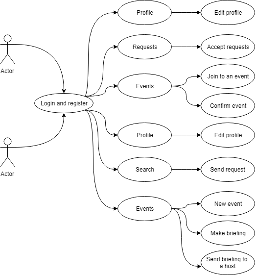
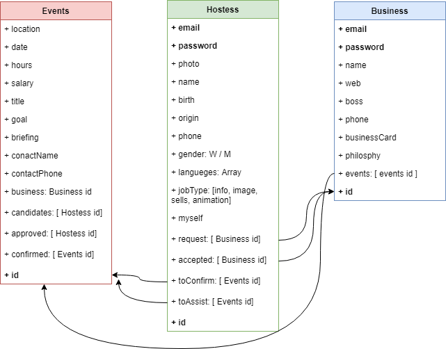

# Hostess

The applications has two diferent profiles. You can be a worker or a company, both of them are conected with the events created by the companies. 

Both profiles must be registered to use the application. 

Companies can create events and look for workers.
Workers must accept the companies requests and then they can apply for the events of the companies. 

## Technologies

### Backend

NodeJs, Express, MongoDB, Mongoose, JWT, TDD, Mocha-chai

### Frontend

ES6, React, CSS

### Use case

## Technical description

### Architecture

### Data model

